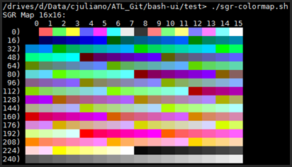
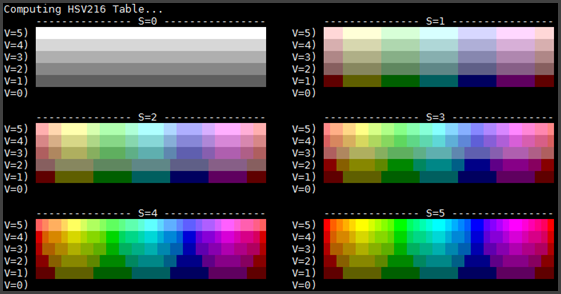
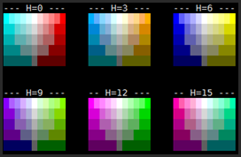
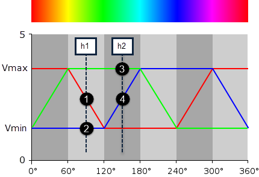
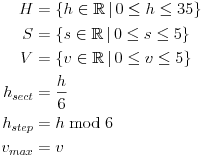
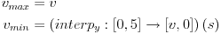
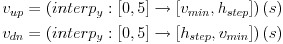
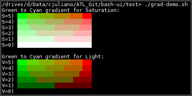
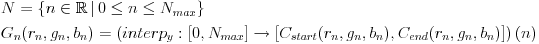

# BASH-UI - Colorspace Manipulation

This document explains the implimentaion of terminal color manipulation in the Bash UI program which
includes functionality for RGB, Gray and [HSV (Hue/Saturation/Value)][HSV_WIKI] colorspaces. See
[README.md][README] for the top-level user documentation.

The following examples use the functions defined in in [bui-term-sgr.sh][TERM_SGR].

[README]: <README.md> 
[TERM_SGR]: <src/bui-term-sgr.sh>

## Table of Contents

- [SGR Color Map](#sgr-color-map)
- [XTerm Colorspaces](#xterm-colorspaces)
- [HSV Colorspace](#hsv-colorspace)
    - [HSV Overview](#hsv-overview)
    - [HSV Implimentation](#hsv-design)
    - [Integer Interpolation](#integer-interpolation)
    - [HSL Calculation](#hsl-calculation)
- [Gradient Colormaps](#gradient-colormaps)
- [See Also](#see-also)
- [Author](#author)

## SGR Color Map

Terminal colors are set with the [SGR control sequence][SGR_REFERENCE]. The example below shows
a 16x16 map of the XTerm 256-color SGR command from the [sgr-colormap.sh][SGR_SCRIPT].



In the above map the color values sent to the SGR control sequence range from 0 to 255. The map is
divided into sections as follows.

| Start | Size  | Description       |
| ---:  | ---:  | ---               |
| 0     | 8     | ANSI normal       |
| 8     | 8     | ANSI highlight    |
| 16    | 216   | 6x6x6 RGB colors  |
| 232   | 24    | Gray colors       |

You can test sending of 256-color SGR commands from the Bash prompt. The below commands will set the
text color attributes for codes `196` (red), `46` (green), and `21` (blue). The trailing command
`\e[0m` will reset the color to default.

```sh
echo -e "\e[38;5;196m Red \e[0m"
echo -e "\e[38;5;46m Green \e[0m"
echo -e "\e[38;5;21m Blue \e[0m"
```

The SGR command from the first Bash line above can be broken down to the following format:

```raw
<CSI><Param>;5;<Color><SGR>
CSI = "\e["
SGR = "m"
Param = [ 38 = foreground | 48 = background ]
Color = [ 0 - 255 ]
```

Setting color attributes is the easy part. The following sections describe how to calulate color
codes to control attributes like intensity or color content.

[SGR_REFERENCE]: <http://vt100.net/docs/vt510-rm/SGR.html>
[SGR_SCRIPT]: <test/sgr-colormap.sh>

## XTerm Colorspaces

Except for HSV there are functions defined to work with 4 separate colorspaces.

| Name      | Dimensions    | Positions | Description                                      |
| ---       | ---           | ---       | ---                                              |
| `ansi16`  | 8x2           | 0-15      | Traditional 8 colors with normal and highlight   |
| `xterm240`| 240           | 16-255    | All 240 colors following the 16 ANSI colors      |
| `rgb216`  | 6x6x6         | 16-231    | 216 colors from `xterm240` parameterized as RGB  |
| `grey26`  | 26            | 231-255,0 | Includes 24 gray colors not in `rgb216`          |

The [rgb-demo.sh][RGB_DEMO] script shown below gives examples of how these can be used.


Given 3 values for RGB each ranging from 0-5 we can calculate the SGR color.

```raw
<SGR> = <red>*36 + <green>*6 + <blue> + 16
```

Given an SGR color we can separate its RGB components with the below pseudocode.

```
int temp = <SGR>
temp -= 16

int <blue> = temp % 6
temp /= 6
int <green> = temp % 6
temp /= 6
int <red> = temp
```

Parameterized functions like the examples below make these operations easier to build on.

```sh
fn_sgr_ansi16_set $((SGR_ATTR_BG + SGR_ATTR_BRIGHT)) $_color

fn_sgr_rgb216_set $SGR_ATTR_BG 0 0 5

fn_sgr_grey26_set $SGR_ATTR_BG 15
```

[RGB_DEMO]: <test/rgb-demo.sh>

## HSV Colorspace

### HSV Overview

The RGB colorspace is convenient for hardware that needs to drive a display but it can make some
operations difficult. For example computing colors from dull to deep aqua in RGB is difficult. The
[HSV/HSV colorspaces][HSV_WIKI] were developed in the 1970's (and patented) to make these types of
operations easy while minimizing computational overhead.

### HSV Implimentation

Some difficulties implimenting HSV in Bash include the limited number of RGB colors availalbe and
the lack of floating point arithmatic used in popular algorithms. To address this the 6x6x6 `rgb216`
colorspace was rationalized to a 6x6x36 `hsv216` space. The parameters are:

* **Hue[0-35]:** 36 values consisting of 6 colors separated by 6 transitional values corresponding
to red, yellow, greeen, cyan, blue, and magenta.

* **Saturation[0-5]:** 6 values where 0 indicates no color and 5 is the deepest color.

* **Value[0-5]:** 6 values of intensity where 0 is black and 5 is full intensity.

The screenshot below from [hsv-demo.sh][HSV_DEMO] shows 36x6 maps of H and V for different levels of
S. It should be noted that 6x6x36 combinations of parameters lead to 1296 results. This is because
when S or V are less than 5 the colors progressively overlap as they approach the center of the [HSV
cylinder][HSV_CYLINDER].



The [hsv-demo.sh][HSV_DEMO] script also generates compliment maps as shown in the below screenshot.
Each map displays one of the 6 hues mentioned above where S is varied from -5 to +5. Negative values
of saturation give its compliment (e.g. red and cyan are compliments because they are separated by
180&deg; in the [HSV cylinder][HSV_CYLINDER]).



These approximate the [HSV swatches][HSV_SWATCHES] on Wikipedia. We can't expect a great
approximation with 216 colors but results may vary between terminals.

[HSV_WIKI]: <https://en.wikipedia.org/wiki/HSL_and_HSV>
[HSV_DEMO]: <test/hsv-demo.sh>
[HSV_SWATCHES]: <https://en.m.wikipedia.org/wiki/Template:Hsv-swatches>
[HSV_CYLINDER]: <https://en.wikipedia.org/wiki/HSL_and_HSV#/media/File:Hsl-hsv_models.svg>

### Integer Interpolation

The Bash HSV calculation can't take advantage of popular algorithms because it does not support
floating point operations. Also, it needs to provide exact results due to the limited number of
colors availble.

The implimentation is based on a versatile interpolation function used multiple times in the HSV
algorithm and also for RGB gradients. The interpolation provides a linear maping from the range
[0,`x2`] on the X domain onto range [`y1`,`y2`] on the Y domain. In [set builder][SET_BUILDER] notation this gives:

&nbsp;&nbsp;&nbsp;&nbsp;&nbsp;&nbsp;

This is implimented in the `fn_sgr_interp_y` Bash function. The parameters `x2`, `y1`, and `y2`
define the linear map and `xp` is the point being mapped.

```raw
<yp> = fn_sgr_interp_y <x2> <y1> <y2> <xp>
x2 = max x-axis
y1 = min y-axis
y2 = max y-axis
xp = point on the x-axis to map
yp = point in the y-axis to map
```

The mapping is based on a [line equation][LINE_EQUATION] for the point (`xp`,`yp`) through a line
defined by the points (`x1`,`y1`) and (`x2`,`y2`).

&nbsp;&nbsp;&nbsp;&nbsp;&nbsp;&nbsp;

Setting `x1`=0 (since it is always zero) and solving for `yp` we have:

&nbsp;&nbsp;&nbsp;&nbsp;&nbsp;&nbsp;

Finally, because we working with integer math we need to consider rounding error. The
`fn_sgr_interp_y` function has an optional flag for nearest rounding. This is because there are
cases where we don't want to round (e.g. the `vMin` calculation below).

[SET_BUILDER]: <https://en.wikipedia.org/wiki/Set-builder_notation>
[LINE_EQUATION]: <https://en.wikipedia.org/wiki/Line_(geometry)#On_the_Cartesian_plane>

### HSL Calculation

The diagram below shows how intensity of RGB channels vary with hue. Each RGB channel is identical
except that they are out of phase by 120&deg;.

* X-Axis: The 360&deg; of hue are related to the 36 `H` values of the calculation by a factor
of 10.
* Y-Axis: This indicates the level of RGB output which is between 0 and 5.
* The red, green, and blue lines show the intensity of each of the RGB channels.
* The top line indicated by `Vmax` determines the brightness and is directly related to the V
paramter.
* The bottom line indicated by `Vmin` deterimes the saturation and is closely related to the S
parameter.

[](https://en.wikipedia.org/wiki/HSL_and_HSV#/media/File:HSV-RGB-comparison.svg)

The objective of the calculation is to represent a function for the RGB channels given HSV
parameters. The above diagram has vertical lines labeled `h1` at 90&deg; and `h2` at 150&deg; and
where they intersect the RGB functions there are 4 points are indicated over the line segments.

| Segment | Name   | Description                   |
| ---     | ---    | ---                           |
| 1       | `Vdn`  | Downward sloping line segment |
| 2       | `Vmin` | Minimum RGB value             |
| 3       | `Vmax` | Maximum RGB value             |
| 4       | `Vup`  | Upward sloping line segment   |

Given the values of these segments within one of the 6 sectors we can calulate all 3 RGB values. The
values are determined as follows from the `interp_y` function. Given `H` we determine `Hsect`
indicating which of the 6 sectors we are in and `Hstep` indicating the position within the sector.

&nbsp;&nbsp;&nbsp;&nbsp;&nbsp;&nbsp;

Next we calculate `Vmin` and `Vmax`. As `S` increases from 0 to 5, `Vmin` decreases to `V` to 0. We
don't round the `vMin` result because it an input to other parameters that are also rounded which
would compound the error and alter hue. The below notation for `Vmin` says that a map is defined
between 2 ranges using `fn_sgr_interp_y` and applied to `S`.

&nbsp;&nbsp;&nbsp;&nbsp;&nbsp;&nbsp;

Next we calculate `Vup` and `Vdn` based on `S`. `Vdn` increases with the inverse of `Vup` and so the
Y parameters are swapped below.

&nbsp;&nbsp;&nbsp;&nbsp;&nbsp;&nbsp;

Finally with `Vup`, and `Vdn` we can determine the RGB parameters for each sector based on `Hsect`.

| Sector | Red    | Green  | Blue   |
| ---    | ---    | ---    | ---    |
| 0      | `Vmax` | `Vup`  | `Vmin` |
| 1      | `Vdn`  | `Vmax` | `Vmin` |
| 2      | `Vmin` | `Vmax` | `Vup`  |
| 3      | `Vmin` | `Vdn`  | `Vmax` |
| 4      | `Vup`  | `Vmin` | `Vmax` |
| 5      | `Vmax` | `Vmin` | `Vdn`  |

The HSL values are computed by `fn_sgr_hsv216_calc` and they can optionally be cached in a lookup
table if `fn_sgr_hsv216_init` is called.

`fn_sgr_hsv216_get` is used lookup values in the table or calculate on demand and it provides some
additional normalization to handle out of range values for S and H. `fn_sgr_hsv216_set` is called to
invoke the SGR command for an HSV color.

## Gradient Colormaps

The below screenshot from [grad-demo.sh][GRAD_DEMO] shows 2 sets of gradients. The first is
calculated with decreasing saturation and the second with descreasing brightness.



The gradient function `fn_sgr_rgb216_grad` calculates an array of RGB colors based on specified
starting and ending RGB colors. The input colors can be calculated in RGB or HSV.

```raw
fn_sgr_rgb216_grad <map-name> <map-size> <start-color> <end-color>
map-name = Name of array to store results
map-size = Number of colors to calculate
start-color = First color in the gradient
end-color = Last color in the gradient
```

Basic steps are as follows. See [grad-demo.sh][GRAD_DEMO] for an example.

1. Calculate start and end colors with `fn_sgr_hsv216_get` or `fn_sgr_rgb216_get`.
1. Call `fn_sgr_rgb216_grad` to calculate the colormap.
1. For each color call `fn_sgr_xterm240_set` to set the foreground or background.
1. Use `fn_sgr_print` or echo to display colors.

The `fn_sgr_rgb216_grad` function uses `fn_sgr_interp_y` to calculate intermediate colors. As a
first step it unpacks the start and end `xterm240` colors into separate RGB channels. For each
gradient index `n` in the set of indexes `N` it computes the gradient color `Gn` having RGB
components by interpolating with map from the index space to the start and end colors.

&nbsp;&nbsp;&nbsp;&nbsp;&nbsp;&nbsp;

RGB components are packed into an `xterm240` with `fn_sgr_rgb216_get`.

[GRAD_DEMO]: <test/grad-demo.sh>

## See Also

* [Bash FAQ 037](http://mywiki.wooledge.org/BashFAQ/037)
* [bash:tip_colors_and_formatting](http://misc.flogisoft.com/bash/tip_colors_and_formatting)
* [XTerm Termal Codes](http://www.xfree86.org/4.7.0/ctlseqs.html): Complete reference
* [Console Virtual Terminal Sequences](https://msdn.microsoft.com/en-us/library/windows/desktop/mt638032.aspx): Microsoft docs highlighting common termial codes.

## Author

- [Chad Juliano](https://github.com/chadj2)
